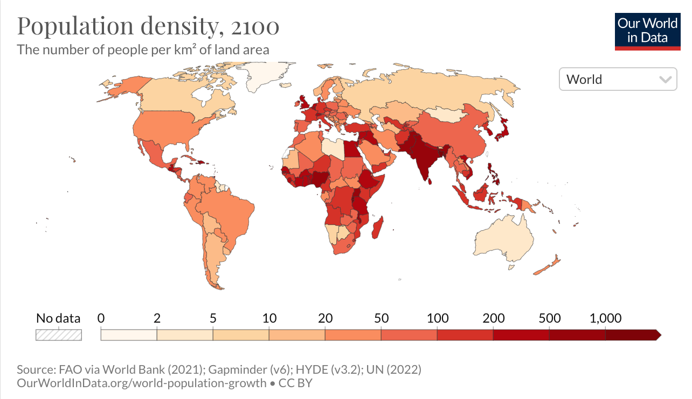
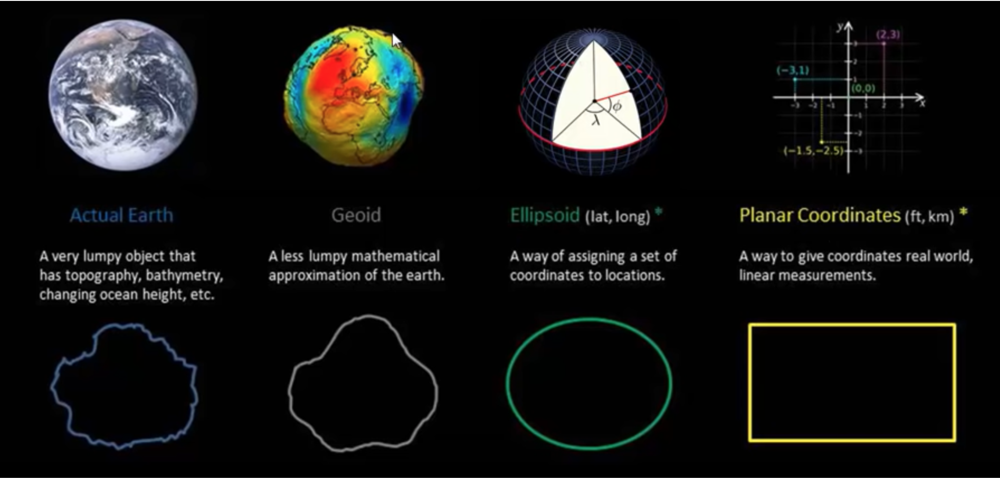
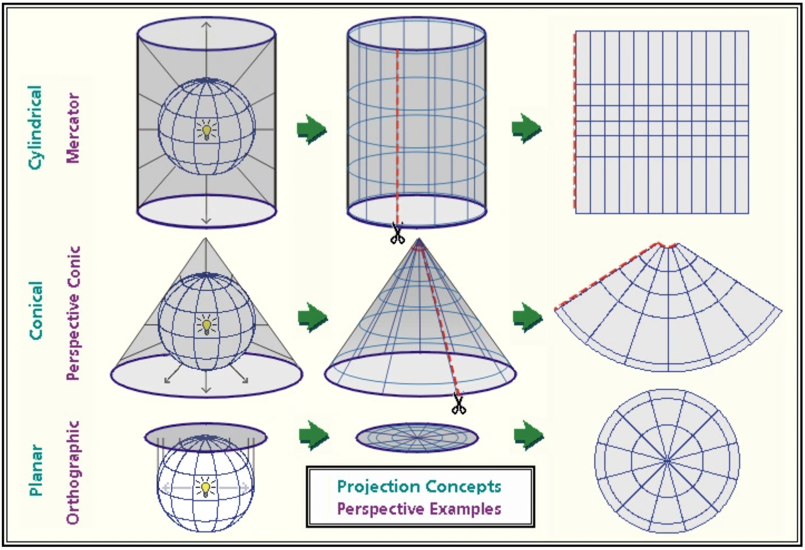
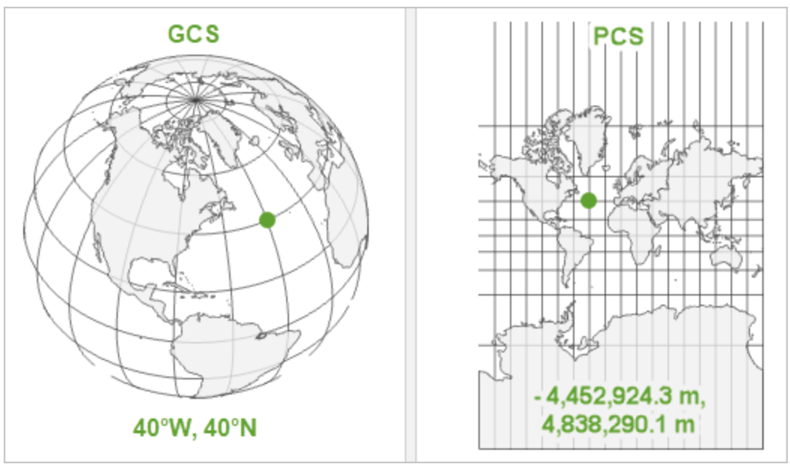
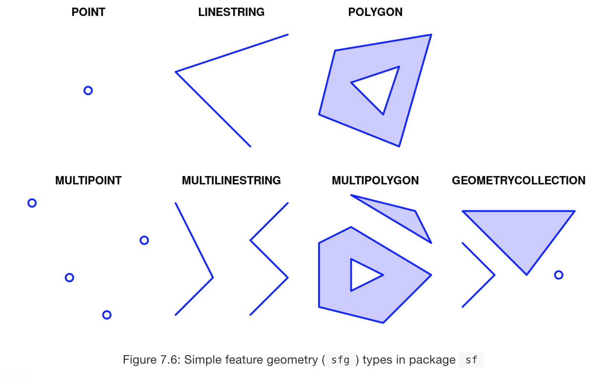
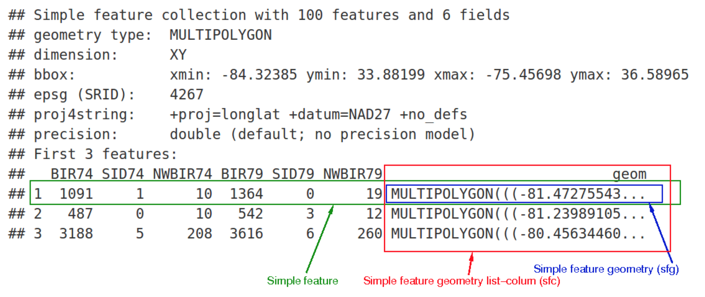
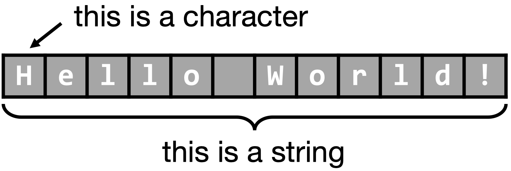

```{css, echo=FALSE} 
@media print { # print out incremental slides; see https://stackoverflow.com/questions/56373198/get-xaringan-incremental-animations-to-print-to-pdf/56374619#56374619
  .has-continuation {
    display: block !important;
  }
}
```

```{r setup, include=FALSE}
# figures formatting setup
#none of this is seen on the slides!!!!!!!!
options(htmltools.dir.version = FALSE)
library(knitr)
opts_chunk$set(
  prompt = T,
  fig.align="center", #fig.width=6, fig.height=4.5, 
  # out.width="748px", #out.length="520.75px",
  dpi=300, #fig.path='Figs/',
  cache=F, #echo=F, warning=F, message=F
  engine.opts = list(bash = "-l")
  )

## Next hook based on this SO answer: https://stackoverflow.com/a/39025054
knit_hooks$set(
  prompt = function(before, options, envir) {
    options(
      prompt = if (options$engine %in% c('sh','bash')) '$ ' else 'R> ',
      continue = if (options$engine %in% c('sh','bash')) '$ ' else '+ '
      )
})

library(tidyverse)
```


# Presentation Outline


<br>

.pull-left[
.pull-left[
##1: Background


1.1 [Why Measure the World?](#motivation)

1.2 [How to Measure the World?](#technical_info)

1.3 [Takeways from this Geography Lesson](#)


]

.pull-right[
##2: sf Package

2.1 [Simple Features Overview](#disambiguation)

2.2 [sf Geometry](#polygons)

2.3 [sf objects in R](#dataframes)

]

]

.pull-right[


##3: Functions, Operations

3.1 [Key Functions](#)

3.2 [Operations](#)

3.3 [Applications 1](#dataframes)
]


---
class: inverse, center, middle
name: section1

# 1: Background for the Package

<html><div style='float:left'></div><hr color='#EB811B' size=1px style="width:1000px; margin:auto;"/></html>


---
# 1.1 Why Measure the World?
<br>

.pull-left[



]

--
.pull-right[

<br>

**Motivation for Mapping, Projections...**

- Visualising data with maps

- Working with spatial data (there is so much information we don't see!)


]

---
class: inverse, center, middle
name: goal


#Goal: Ability to measure distance between any two points in the world


---
# 1.2 How to Measure the World?





---
# 1.2 How to Measure the World? (Cont'd)

.pull-left[
<br>
###Datums!
Offer us an initial solution.
In english: **Datum:** “the way we use the ellipsoid to try to fit the geoid”


<br>
###In general, two Datums
1. WGS84 (World Geodetic System of 1984) fits whole world to an okay extent
2. NAT83 fits North America better, but worse for rest of world


]

.pull-right[


]


---
# 1.2 How to Measure the World?


---
# 1.2 How to Measure the World? (cont'd cont'd)





---
# 1.3 Takeaways for Our Purposes Today

<br>

###Three things to remember:
.pull-left[
1. Geographic Coordinate Systems (ellipsoids) help us assign coordinates to locations and are **always in degrees**

2. Projected Coordinate Systems (2D) are each based on a Geographic CS and help us measure things **in measurable units** (Kilometers...)

3. You will always end up with distortion! So it's important to know the systems your data and your maps are based in

]





---
class: inverse, center, middle
name: section1

# 2: The 'Simple Features' Package

<html><div style='float:left'></div><hr color='#EB811B' size=1px style="width:1000px; margin:auto;"/></html>


---
# 2.1 'Simple Features' Overview
<br>

.pull-left[


]

--

.pull-right[
**Simple Features** is a formal standard that **describes how 'features' can be represented in computers and stored in databases**


**Features** are 'objects in the real world'
- House, Street, City, Country...

**Geometry** of a 'Feature' describes its attributes
- Relative Location, Population, Height, Colour, Temperature
- Geometries are composed of 'points' or 'coordinates' in a 2D, 3D, or 4D space


]


---
# 2.2 sf Geometry Visualization





---
# 2.3 The Simple Features Object in R

###SF Objects in R...
1. Are **stored in a DataFrame**
2. **Each 'Attribute'** has its own column
3. The Attribute **'Geometries'** is stored in `geom` column **as a list**





---
# Grammar of XPath

### Navigational operators `"."`and `".."`

- `"."` accesses elements on the same level ("self axis"), which is useful when working with predicates (see later!).
- `".."` accesses elements at a higher hierarchical level.

```{r, eval = TRUE, message= FALSE}
#html_elements(parsed_doc, xpath = "//title/..")
```

```{r, eval = TRUE, message= FALSE}
#html_elements(parsed_doc, xpath = "//div[starts-with(./@id, 'R')]")
```


---
# Content extraction 

- Until now, we used XPath expressions to extract complete nodes or nodesets (that is, elements with tags).
- However, in most cases we're interested in extracting the content only.
- To that end, we can use extractor functions that are applied on the output of XPath query calls.

| Function  |  Argument | Return value |
|---|---|---|
| `html_text()` |  | Element value |
| `html_text2()` |  | Element value (with a bit more cleanup) |
| `html_attr()` | `name` | Element attribute |
| `html_attrs()` |  | (All) element attributes |
| `html_name()` | `trim` | Element name |
| `html_children()` |  | Element children |


---
# More XPath?

### Training resources

- XPath is a little language of its own. As always with languages, mastery comes with practice.
- A good environment for practice is the [XPath expression testbed at whitebeam.org](http://www.whitebeam.org/library/guide/TechNotes/xpathtestbed.rhtm).
- Also check out this [cheat sheet](https://devhints.io/xpath).

### XPath creator tools

- Now, do you really have to construct XPath expressions by your own? No! At least not always.
- **SelectorGadget**: [http://selectorgadget.com](http://selectorgadget.com) is a browser plugin that constructs XPath statements via a point-and-click approach. The generated expressions are not always efficient and effective though (more on this later).
- Web developer tools - the internal browser functionality to study the DOM, among other things, also lets you extract XPath statements for selected nodes. These are specific to unique nodes/elements though, and therefore less helpful to extract node sets. (But they come in handy when we want to script live navigation, e.g. for Selenium.)


---
# What is CSS?

.pull-left[
### Background

- **C**ascading **S**tyle **S**heets (CSS) is a style sheet language that allows web developers to adjust the "look and feel" of websites.
- By using CSS to adjust style features such as layout, colors, and fonts, it's easier to separate content (HTML) from presentation (CSS).

### Three ways to insert CSS into HTML

1. **External CSS.** Inside `<head>` with a reference to the external file inside the `<link>` element.
2. **Internal CSS.** Inside `<head>` and stored in `<style>` elements. 
3. **Inline CSS.** Inside `<body>` using the `style` attribute of elements.
  
]

--

.pull-right[
**External CSS**
```{html, prompt = FALSE, eval = FALSE}
<head>
  <link rel="stylesheet" href="mystyle.css">
</head>
```

**Internal CSS**
```{html, prompt = FALSE, eval = FALSE}
<head>
   <style>
      h1 {
         color: red;
         margin-left: 20px;
      }
   </style>
</head>
```

**Inline CSS**
```{html, prompt = FALSE, eval = FALSE}
<p style="color: blue;">This is a paragraph.</p>
```
]


---
class: inverse, center, middle
name: regex

# Regular expressions

<html><div style='float:left'></div><hr color='#EB811B' size=1px style="width:1000px; margin:auto;"/></html>


---
# What are regular expressions?

.pull-left[
### Definition

Regular expressions a.k.a. *regex* or *RegExp* is a tool - a little language of it's own really - that lets you describe patterns in text/strings.

Funnily, a regular expression itself is a sequence of characters, some with special, some with literal meaning.

Regular expressions are widely applicable and implemented in many programming languages, including R, as well as search engines, search and replace dialogs, etc.

<div align="center">

</div>
]

--

.pull-right[
### Why is this useful for web scraping?

Information on the web can often be described by patterns (think email addresses, numbers, cells in HTML tables, ...).

If the data of interest follow specific patterns, we can match and extract them - regardless of page layout and HTML overhead.

Whenever the information of interest is (stored in) text, regular expressions are useful for extraction and tidying purposes.
]


---
# Backreferencing *cont.* 

**Goal:** Match a word that does not include  "a" until the word appears the second time.

**Solution:**

```{r}
#str_extract(example.obj, "([ [:punct:]][b-z]+[ [:punct:]]).+?\\1")
```

**How it works:**

- Match all letters without a, therefore: `[b-z]`
- Match complete words with beginning/end: `[ [:punct:]]`
- Define first word pattern* `(...)`
- Match anything between occurrences of both words: `.+?`
- Refer to original word `\\1`


