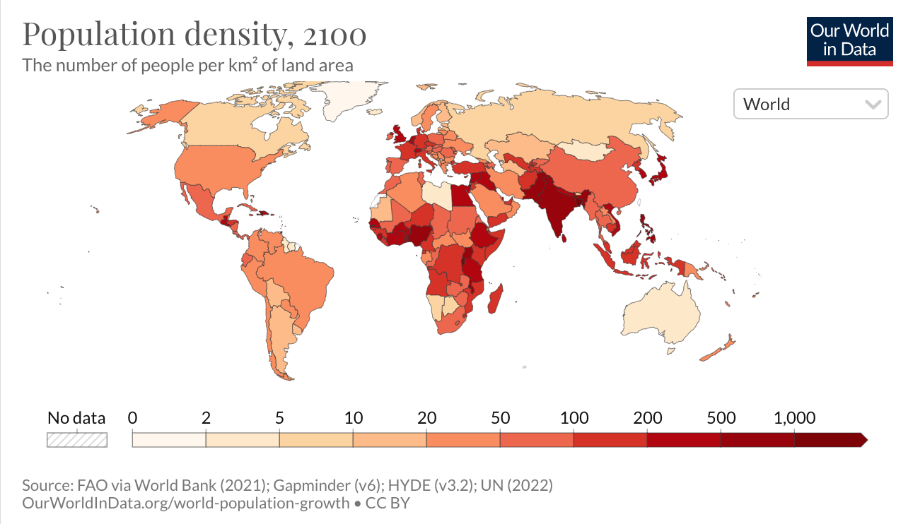
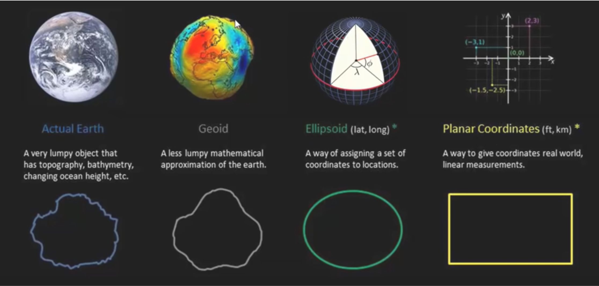
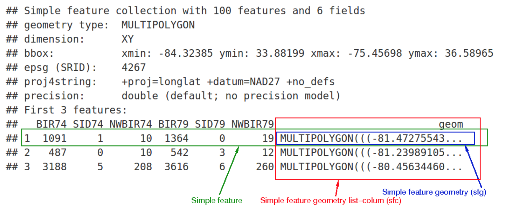

```{css, echo=FALSE} 
@media print { # print out incremental slides; see https://stackoverflow.com/questions/56373198/get-xaringan-incremental-animations-to-print-to-pdf/56374619#56374619
  .has-continuation {
    display: block !important;
  }
}
```

```{r setup, include=FALSE}
# figures formatting setup
#none of this is seen on the slides!!!!!!!!
options(htmltools.dir.version = FALSE)
library(knitr)
opts_chunk$set(
  prompt = T,
  fig.align="center", #fig.width=6, fig.height=4.5, 
  # out.width="748px", #out.length="520.75px",
  dpi=300, #fig.path='Figs/',
  cache=F, #echo=F, warning=F, message=F
  engine.opts = list(bash = "-l")
  )

## Next hook based on this SO answer: https://stackoverflow.com/a/39025054
knit_hooks$set(
  prompt = function(before, options, envir) {
    options(
      prompt = if (options$engine %in% c('sh','bash')) '$ ' else 'R> ',
      continue = if (options$engine %in% c('sh','bash')) '$ ' else '+ '
      )
})

knitr::opts_chunk$set(warning = FALSE, message = FALSE) 


library(tidyverse)
library(spData)
library(sf) 
library(gridExtra)
library(units)
```


# Presentation Outline


<br>

.pull-left[
.pull-left[
##1: Background


1.1 [Why Measure the World?](#motivation)

1.2 [How to Measure the World?](#technical_info)

1.3 [CRS definition](#)


]

.pull-right[
##2: sf Package

2.1 [Simple Features Overview](#disambiguation)

2.2 [sf Geometry](#polygons)

2.3 [sf objects in R](#dataframes)

]

]

.pull-right[


##3: Functions, Operations

3.1 [Working with CRS](#)

3.2 [Computations with sf](#)

3.3 [Applications 1](#dataframes)
]


---
class: inverse, center, middle
name: section1

# 1: Background for the Package

<html><div style='float:left'></div><hr color='#EB811B' size=1px style="width:1000px; margin:auto;"/></html>


---
# 1.1 Why Measure the World?
<br>

.pull-left[



]

--
.pull-right[

<br>

**Motivation for Mapping, Projections...**

- Visualising data with maps

- Working with spatial data (there is so much information we don't see!)


]
---
# 1.2 How to Measure the World?





---
# 1.3 Coordinate Reference Systems

###Coordinate Reference Systems (CRS)

- A CRS **specifies** which **location on earth** the spatial elements or coordinates of the data refer to
- CRSs are either **geographic** or **projected**

|   |  Geographic Coordinate System (GCS) | Projected Coordinate System (PCS) |
|---|---|---|
| Model | Ellipsoidal (datums: geocentric or local) | Cartesian plane (map projections from GCS into 2D) |
| Coordinates | Longitude (East-West) and Latitude (North-South) | Easting and Northing |
| Units | Degrees | Linear unit (e.g. metres) |

###Projected Coordinate Systems
- Based on a geographic CRS and **projects a 3D surface** onto a flat surface
- Datum is transferred to a planar (cartesian) coordinate system using **conic**, **cylindrical** or **planar** projections
- This process **distorts some properties of the earth’s surface** (e.g. area, direction, distance, and shape)

---
# 1.3 Coordinate Reference Systems


---
# 1.3 Coordinate Reference Systems

.pull-left[

###CRS Components
A CRS comprises of
- An Earth ellipsoid
- A datum
- A map projection (expect for geographic coordinate systems)
- An origin point and
- A unit of measurement

###Common standards for CRS
- EPSG
- proj4
- Well-known Text (WKT)
]

.pull-right[
```{r}
st_crs(world)
```
]

---
class: inverse, center, middle
name: section1

# 2: The 'Simple Features' Package

<html><div style='float:left'></div><hr color='#EB811B' size=1px style="width:1000px; margin:auto;"/></html>

---
# 2.1 'Simple Features' Overview

### The sf package
.pull-left[
**Simple Features** is a formal standard that **describes how 'features' can be represented in computers and stored in databases**


**Features** are 'objects in the real world'
- House, Street, City, Country, ...

**Geometries** of features describe where on Earth the feature is located and are composed of coordinates in a 2-, 3- or 4-dimensional space 
- XY, XYZ, ...

**Attributes** of a feature contain more specific information about the feature itself
- Population, Height, Colour, Temperature

]

.pull-right[


]


---
# 2.2 sf Geometry Visualization


---
# 2.3 The Simple Features Object in R

###Simple Features data frames
1. All features are **stored in a DataFrame** with columns for the attributes (sf object)
3. Each feature **'Geometry'** is saved **as a list** element (sfg object)
3. The **'Geometries'** are put in a list-column called `geometry` or `geom` (sfc object)



---
# 3.1 Working with CRS 

###1: sf object output
```{r}
world %>% 
  select(iso_a2, name_long, continent, subregion, area_km2) %>% 
  head(5)
```

---
# 3.1 Working with CRS (Cont'd)

###2: Retrieving the CRS

.pull-left[
**Well-Known_Text (WKT)**

```{r}
st_crs(world)
```

]

.pull-right[
**EPSG**
```{r}
st_crs(world)$srid

```

**Proj4**
```{r}
st_crs(world)$proj4string
```
]

---
# 3.1 Working with CRS (Cont'd)

.pull-left[
###3: Changing the CRS
```{r}
world_mercator <- world %>% 
  st_set_crs(3857)

st_crs(world_mercator)$srid
```
]

.pull-right[
###WGS84 Pseudo Mercator
```{r, echo = FALSE, out.width="80%"}
world %>% 
  ggplot() +
  geom_sf() +
  coord_sf(crs = st_crs(3857)) + 
  theme_bw()
```
]


---
# 3.1 Working with CRS (Cont'd)

.pull-left[
###Original CRS
```{r}
st_crs(world)$srid
```
]

.pull-right[
###WGS84 - World Geodetic System 1984, used in GPS
```{r, echo = FALSE, out.width="100%"}
world %>% 
  ggplot() +
  geom_sf() +
  coord_sf(crs = st_crs(4326)) + 
  theme_bw()
```
]

---
# 3.2 Computations with sf

.pull-left[
### Area

By using the `st_area()` function, we can calculate the area of a country directly from the sf and the specified CRS. 

```{r}
germany_area <- world %>%
  filter(iso_a2 == "DE") %>% 
  st_area() %>% 
  units::set_units(km^2)
```

```{r}
print(germany_area)
```

]

.pull-right[
### Distance

The `sf_distance()`function lets us calculate the distance between two features. In this example, we determine the distance between the center of Germany and Australia by using the `st_centroid()` function.
```{r}
de <- world %>% 
  filter(iso_a2 == "DE") %>% 
  st_centroid()

au <- world %>% 
  filter(iso_a2 == "AU") %>% 
  st_centroid()

print(set_units((st_distance(de, au)), km))
```
]

---
# 3.3 Map-Making

### Plot() function
```{r}
plot(world['continent'])
```

---
# 3.3 Map-Making

### Plot() function
```{r}
world_select <- world %>% select(iso_a2, continent, pop, lifeExp)

plot(world_select)
```


