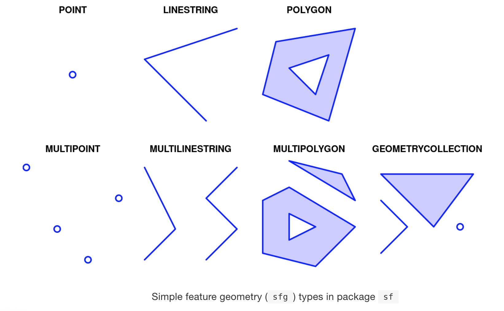

```{css, echo=FALSE} 
@media print { # print out incremental slides; see https://stackoverflow.com/questions/56373198/get-xaringan-incremental-animations-to-print-to-pdf/56374619#56374619
  .has-continuation {
    display: block !important;
  }
}
```

```{r setup, include=FALSE}
# figures formatting setup
#none of this is seen on the slides!!!!!!!!
options(htmltools.dir.version = FALSE)
library(knitr)
opts_chunk$set(
  prompt = T,
  fig.align="center", #fig.width=6, fig.height=4.5, 
  # out.width="748px", #out.length="520.75px",
  dpi=300, #fig.path='Figs/',
  cache=F, #echo=F, warning=F, message=F
  engine.opts = list(bash = "-l")
  )

## Next hook based on this SO answer: https://stackoverflow.com/a/39025054
knit_hooks$set(
  prompt = function(before, options, envir) {
    options(
      prompt = if (options$engine %in% c('sh','bash')) '$ ' else 'R> ',
      continue = if (options$engine %in% c('sh','bash')) '$ ' else '+ '
      )
})

knitr::opts_chunk$set(warning = FALSE, message = FALSE) 


library(tidyverse)
library(spData)
library(sf) 
library(gridExtra)
library(units)
```

# Presentation Outline
.pull-left[
##1: Concepts & Context

1.1 Why Measure the World?

1.2 How to Measure the World?

1.3 Coordinate Reference Systems

##3: sf Functions & Operations

3.1 Working with CRSs

3.2 Computations with sf

3.3 Map-Making with sf

]

.pull-right[
##2: The sf Package

2.1 Simple Features Overview

2.2 sf Geometry Visualization

2.3 Simple Features in R

##4: Exercise Session

]
---
class: inverse, center, middle
name: section1

# 1: Concepts & Context

<html><div style='float:left'></div><hr color='#EB811B' size=1px style="width:1000px; margin:auto;"/></html>


---
# 1.1 Why Measure the World?

##Communicating Information

--
.pull-left[


]

--
.pull-right[

<br>

**Motivation for Mapping, Measuring...**

- Using maps for visualization

- Working with spatial data 

- Unexpected insights


]
---
# 1.2 How to Measure the World?

##Approximating the Earth


---
# 1.3 Coordinate Reference Systems

##Introduction to CRSs

- A CRS **specifies** which **location on earth** the spatial elements or coordinates of the data refer to
- CRSs are either **geographic** or **projected**

|   |  Geographic Coordinate System (GCS) | Projected Coordinate System (PCS) |
|---|---|---|
| Model | Ellipsoidal (datums: geocentric or local) | Cartesian plane (map projections from GCS into 2D) |
| Coordinates | Longitude (East-West) and Latitude (North-South) | Easting and Northing |
| Units | Degrees | Linear unit (e.g. metres) |

##Projected Coordinate Systems
- A PCS is based on a geographic CRS and **projects a 3D surface** onto a flat surface
- The **datum** is transferred to a planar (cartesian) coordinate system using **conical**, **cylindrical** or **planar** **projections**
- This process **distorts some properties of the earth’s surface** (e.g. area, direction, distance, and shape)

---
# 1.3 Coordinate Reference Systems

.pull-left[
##Projection Types                     
]


.pull-right[
##From GCS to PCS                     
]


---
# 1.3 Coordinate Reference Systems

.pull-left[

##CRS Components
A CRS comprises of
- an earth ellipsoid
- a datum
- a map projection (expect for geographic coordinate systems)
- an origin point and
- a unit of measurement

##Standards for CRSs
- EPSG
- proj4
- Well-known Text (WKT)
]

.pull-right[
```{r}
st_crs(world)
```
]

---
class: inverse, center, middle
name: section1

# 2: The sf Package

<html><div style='float:left'></div><hr color='#EB811B' size=1px style="width:1000px; margin:auto;"/></html>

---
# 2.1 Simple Features Overview

## The sf Package

.pull-right[


]


--

.pull-left[
**Simple Features** is a formal standard that **describes how 'features' can be represented in computers and stored in databases**


**Features** are 'objects in the real world'
- House, Street, City, Country, ...

**Geometries** of features describe where on Earth the feature is located and are composed of coordinates in a 2-, 3- or 4-dimensional space 
- XY, XYZ, ...

**Attributes** of a feature contain more specific information about the feature itself
- Population, Height, Colour, Temperature

]


---
# 2.2 sf Geometry Visualization

##Basic Components of Shapes

--



---
# 2.3 Simple Features in R

##DataFrames of Simple Features
1. All features are **stored in a data frame** with columns for the attributes (sf object)
3. Each feature **'Geometry'** is saved **as a list** element (sfg object)
3. The **'Geometries'** are put in a list-column called `geometry` or `geom` (sfc object)

--


---
class: inverse, center, middle
name: section1

# 3: sf Functions & Operations

<html><div style='float:left'></div><hr color='#EB811B' size=1px style="width:1000px; margin:auto;"/></html>


---
# 3.1 Working with CRSs 

##sf Output

If we simply print an `sf` object, the output shows some meta-information about the geometries  
and the CRS as well as the data frame of simple features.

```{r}
world %>% 
  select(iso_a2, name_long, continent, subregion, area_km2) %>% 
  head(3)
```

---
# 3.1 Working with CRSs

##Retrieving the CRS

By using the `st_crs()` function, we can retrieve the CRS and its specifications in different formats.

.pull-left[
**Well-Known-Text (WKT)**

```{r}
st_crs(world)
```

]

.pull-right[
**EPSG**
```{r}
st_crs(world)$srid

```

**Proj4**
```{r}
st_crs(world)$proj4string
```
]

---
# 3.1 Working with CRSs

##Changing the CRS
We can change the CRS by applying the `st_set_crs()` function.

.pull-left[
**Code: New CRS**
```{r, fig.show='hide'}
world_mercator <- world %>% 
  st_set_crs(3857)

st_crs(world_mercator)$srid
```
]

```{r, echo = FALSE, fig.show='hide'}
world %>% 
  ggplot() +
  geom_sf() +
  coord_sf(crs = st_crs(3857)) + 
  theme_bw()
```
.pull-right[
**Plot: WGS84 Pseudo-Mercator Projection**

]


---
# 3.1 Working with CRSs

##Changing the CRS
We can change the CRS by applying the `st_set_crs()` function.

.pull-left[
**Code: Original CRS**
```{r, fig.show='hide'}
st_crs(world)$srid
```
]

```{r, echo = FALSE, fig.show='hide'}
world %>% 
  ggplot() +
  geom_sf() +
  coord_sf(crs = st_crs(4326)) + 
  theme_bw()
```
.pull-right[
**Plot: WGS84 - World Geodetic System 1984, used in GPS**

]

---
# 3.2 Computations with sf

##Doing Measurements

.pull-left[
**Area**

By using the `st_area()` function, we can calculate the area of a country directly from the sf and the specified CRS. 

```{r}
germany_area <- world %>%
  filter(iso_a2 == "DE") %>% 
  st_area() %>% 
  units::set_units(km^2)
```

```{r}
print(germany_area)
```

]

.pull-right[
**Distance**

The `sf_distance()` function lets us calculate the distance between two features. In this example, we determine the distance between the center of Germany and the center of Australia by using the `st_centroid()` function.
```{r}
de <- world %>% 
  filter(iso_a2 == "DE") %>% st_centroid()
au <- world %>% 
  filter(iso_a2 == "AU") %>% st_centroid()
```

```{r}
print(set_units((st_distance(de, au)), km))
```

]

---
# 3.3 Map-Making with sf

To create maps from sf objects, we can either 1) use `plot()` from the sf package or  
2) `ggplot()` from the ggplot2 package.

##plot() function (1)

.pull-left[
If we simply call the `plot()` function, a map   
is created for each of the attributes.
```{r, fig.show='hide'}
plot(world)
```
]


---
# 3.3 Map-Making with sf

##plot() function (2)

.pull-left[
To only show the map corresponding to a  
certain attribute, we can specify the  
attribute inside the `plot()` function.
```{r, fig.show='hide'}
plot(world['continent'])
```
]


---
# 3.3 Map-Making with sf

##ggplot() function

.pull-left[
Since `world` is stored as an sf data frame,  
we can also utilize the `ggplot()` function  
to create maps. For this purpose, we use the  
`geom_sf()` function to add the simple feature  
layer to our plot.
```{r, fig.show='hide'}
world %>%
  ggplot() +
  geom_sf(aes(fill = lifeExp)) +  
  scale_fill_viridis_c() +
  ggtitle("Life expectancy")
```
]


---
class: inverse, center, middle
name: section1

# 4: Exercise Session

Thank you so much for listening! If you want to dive deeper into the sf package and Coordinate Reference Systems, please have a look at the linked sources on our Github repository [Github repository](https://github.com/intro-to-data-science-22-workshop/12-Coordinate-reference-systems-with-sf-brasdefer-korbach/tree/main/slides).

<html><div style='float:left'></div><hr color='#EB811B' size=1px style="width:1000px; margin:auto;"/></html>


